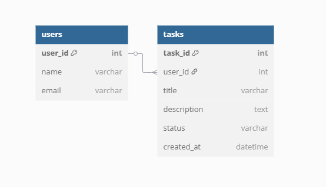

# Task Manager API

## Description
A simple Task Manager API that allows users to create, read, update, and delete tasks. The API is connected to a MySQL database and built using Node.js and Express.

## How to Run/Setup the Project
1. Clone the repository.
   ```bash
   git clone https://github.com/yourusername/task-manager-api.git
   cd task-manager-api
Install dependencies:

npm install
Set up your MySQL database using the provided SQL script (database/create_db.sql).

Run the SQL script in your MySQL Workbench or MySQL command line to create the necessary database and tables.

Run the server:

node src/server.js
The API will be accessible at http://localhost:3000.

ERD (Entity Relationship Diagram)

